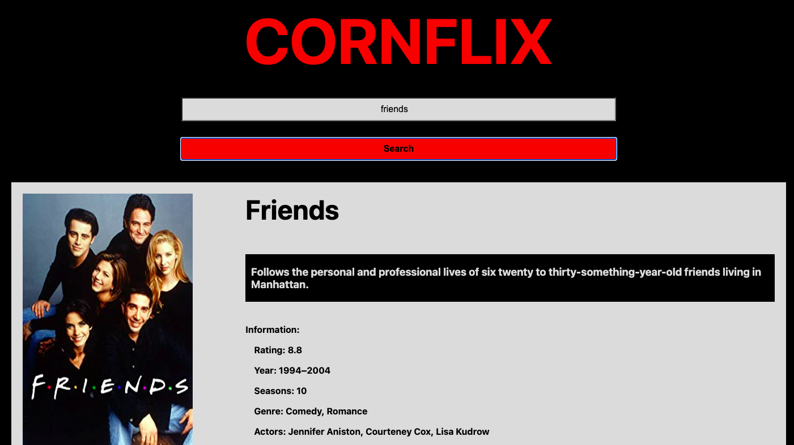
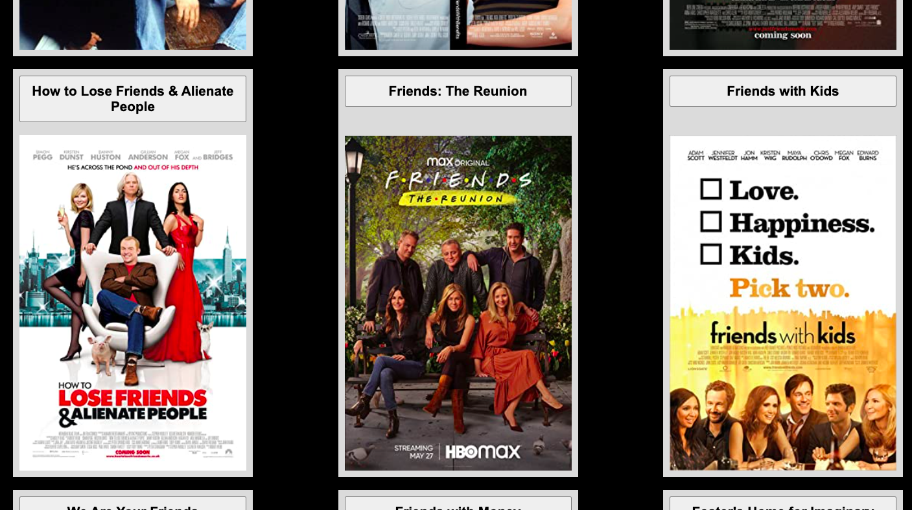

# CORNFLIX movies search app

CORNFLIX app helps you find your favorite movies and TV shows, simply by searching for the desired movie.
It will give you the best result and 10 other suggestions, you can click on the suggestion to show you it's information.

## What does the app contain?

- A home page with introduction to the website, and button to start searching.
- A movie page that includes search bar and search button.
- If you search it will render the best result available with: title, poster, plot, rating, year, genre, actore and more.
- Also you will get 10 other suggestions of movies with title and poster only, and you can click on it to re render the page with desired movie using the id of the movie.

## CORNFLIX demo url

- <https://mosabouni.github.io/router-starter/#home>

## snippets of CORNFLIX

### Home page

### Search result

### Suggestions

Enjoy!
